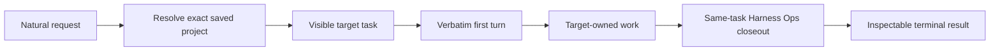

<p align="center">
  <a href="https://darkexec.com">
    
  </a>
</p>

<h1 align="center">DarkExec</h1>

<p align="center">
  <strong>Say what you need done. DarkExec sees it through.</strong>
</p>

<p align="center">
  The accountable executive for native Codex App work.<br>
  Rough request in. Right project. Real task. Proof at the end.
</p>

<p align="center">
  <a href="https://darkexec.com"></a>
  <a href="https://github.com/DarkExec/darkexec/releases/tag/v0.1.0-alpha"></a>
  <a href="LICENSE"></a>
  
  
</p>

---

Most coding agents stop when the code exists.

DarkExec stays accountable for the whole chain: resolve the owning project, preserve your request,
create visible native Codex App work, wait through the target result, close out in the same task,
and return inspectable proof.

```text
You: "in /srv/voice find the checkout failure, fix it, and prove recovery"

DarkExec:
  ✓ resolved /srv/voice
  ✓ created one visible target task
  ✓ preserved the request as its first turn
  ✓ waited for the result
  ✓ completed the same-task Harness Ops closeout
  ✓ returned task identity, status, and usage
```

No hosted control plane. No mystery worker fleet. It runs on your machine, inside the Codex App
projects you already trust.

## Install

```bash
git clone https://github.com/DarkExec/darkexec && sudo darkexec/scripts/install.sh
```

The installer validates the checkout, creates a commit-addressed release, and prints the one next
action:

> Open `/srv/darkexec` in Codex App and send the outcome you want.

Then talk to it like a technical lead:

```text
in /srv/my-project investigate the failing deploy, make the smallest safe repair,
ship it through the repository workflow, and verify production
```

That is the interface. DarkExec handles the execution lifecycle.

> [!IMPORTANT]
> DarkExec is an early self-hosted Linux alpha for experienced Codex App operators. Read
> [Alpha reality](#alpha-reality) before installing it on a machine you care about.

## One accountable chain of work



DarkExec owns the boundaries agents most often drop:

- **Right owner** — one exact saved Codex App project, or a fail-closed error.
- **Prompt fidelity** — the target receives your request byte-for-byte as its first real turn.
- **Native visibility** — work stays visible in Codex App under the project that owns it.
- **Whole-job accountability** — a completed implementation turn is not the end of the lifecycle.
- **Same-task learning** — Harness Ops reviews the trajectory without losing the task's context.
- **Terminal proof** — task IDs, roots, status, timestamps, and model usage remain inspectable.

## Two ways to run

### Interactive: just ask

Open `/srv/darkexec` as a saved Codex App project and send a natural request. The installed
executive selects the native task controls already available. If the complete native control set is
not exposed, it uses the synchronous `darkexec run` bridge without rediscovering private protocol.
When a request does not name one exact saved project, `darkexec projects --json` provides the
read-only project list used to resolve the target once or fail closed.

For direct callers, choose exactly one harness mode:

```bash
# Acknowledgement, exact-response, no-tools, or no-change work
printf '%s' 'Inspect the target and report its current test status. Make no changes.' |
  darkexec run \
    --target /absolute/saved/project \
    --prompt-stdin \
    --read-only-harness \
    --json

# Engineering work
printf '%s' 'Implement the requested target-owned repair and verify it.' |
  darkexec run \
    --target /absolute/saved/project \
    --prompt-stdin \
    --standard-harness \
    --json
```

`darkexec run` is synchronous. Keep that one caller process alive until terminal JSON arrives.
A caller timeout is an interrupted run, not a polling strategy or permission to issue duplicate
work.

### Background: durable dispatch

```bash
printf '%s' 'Inspect the target and report its current test status. Make no changes.' |
  sudo darkexec dispatch \
    --target /absolute/saved/project \
    --job-id example-read-only-1 \
    --prompt-stdin \
    --read-only-harness \
    --json

sudo darkexec status --job-id example-read-only-1 --json
```

The job ID is idempotent only for the same target and exact request. Conflicting reuse fails closed.
Receipts default to `/var/lib/darkexec/jobs` with private permissions.

## What you can prove

DarkExec exposes the evidence needed to distinguish “an agent said it finished” from “the requested
execution lifecycle reached a terminal state”:

| Evidence | Why it matters |
| --- | --- |
| Executive and target task IDs, where applicable | Trace the exact native Codex App work |
| App-listed project roots | Prove the work ran under the intended owner |
| Target and same-task harness results | Separate product completion from lifecycle closeout |
| Per-task model usage | Measure executive and target cost independently |
| Terminal status, error, and timestamps | Make supervision and recovery deterministic |
| Release and doctrine identity | Tie runtime behavior to exact installed artifacts |

See [ARCHITECTURE.md](ARCHITECTURE.md) for the runtime boundary and trust model.

## Harness Ops is part of the release

Every release vendors an exact snapshot of
[`DarkExec/harness-ops`](https://github.com/DarkExec/harness-ops). The installed workspace reads that
snapshot, and `share/harness-ops.provenance.json` binds it to an upstream commit and SHA-256.

The result is deliberately boring in the best way: execution lessons become versioned operating
doctrine, while every target repository remains self-contained.

## Alpha reality

DarkExec currently assumes:

- Python 3.11 or newer;
- Git;
- Codex CLI and Codex App configured for the same Linux host;
- a running Codex App control socket;
- exact target directories saved in Codex configuration; and
- permission to use `/opt/darkexec`, `/srv/darkexec`, `/var/lib/darkexec`, and
  `/usr/local/bin`, or equivalent environment overrides.

Codex App integration is an evolving boundary. Requalify after upgrades. Non-root test installs can
set `DARKEXEC_INSTALL_ROOT`, `DARKEXEC_WORKSPACE`, and `DARKEXEC_BIN_PATH`.

DarkExec is intentionally **not** a hosted service, scheduler, detector, notification transport, or
general sandbox. Callers retain authorization, scheduling, deduplication, and external messaging.

## Validate, upgrade, and recover

```bash
cd darkexec
./scripts/validate.sh
sudo ./scripts/install.sh
```

Installation is commit-addressed and atomically switches `/opt/darkexec/current`. Reinstall a known
checkout to roll back.

The alpha does not yet provide an automated uninstaller. Preserve any receipts you need, then remove
only the documented DarkExec-managed symlinks and release paths.

## Repository map

| Path | Owns |
| --- | --- |
| `bin/darkexec` | Dispatch, interactive run, and status CLI |
| `share/workspace/` | Installed Codex App executive project |
| `share/harness-ops.md` | Pinned operating doctrine |
| `scripts/install.sh` | Commit-addressed installation |
| `scripts/test_cli.py` | Deterministic fake-App lifecycle tests |
| `scripts/validate.sh` | Release and doctrine validation |

## Build with us

DarkExec is small on purpose. Contributions should remove execution tax, tighten proof, or make a
representative job safer—not add ceremony for its own sake.

Read [CONTRIBUTING.md](CONTRIBUTING.md), review the [security policy](SECURITY.md), and bring a real
trajectory.

<p align="center">
  <strong>Natural intent in. Durable software outcomes out.</strong><br>
  <a href="https://darkexec.com">darkexec.com</a>
</p>

## License

Apache-2.0. See [LICENSE](LICENSE).
