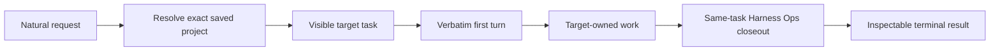

<p align="center">
  <a href="https://darkexec.com">
    
  </a>
</p>

<h1 align="center">DarkExec</h1>

<p align="center">
  <strong>Say what you need done. DarkExec sees it through.</strong>
</p>

<p align="center">
  The accountable executive for native Codex App work.<br> Rough request in. Right project. Real task. Proof at the end.
</p>

<p align="center">
  <a href="https://darkexec.com"></a> <a href="https://github.com/DarkExec/darkexec/releases/tag/v0.1.0-alpha"></a> <a href="LICENSE"></a>
  
  
</p>

---

Most coding agents stop when the code exists.

DarkExec stays accountable for the whole chain: resolve the owning project, preserve your request, create visible native Codex App work, wait through the target result, close out from exact bounded evidence, and return inspectable proof.

```text
You: "in /srv/voice find the checkout failure, fix it, and prove recovery"

DarkExec:
  ✓ resolved /srv/voice
  ✓ created one visible target task
  ✓ preserved the request as its first turn
  ✓ waited for the result
  ✓ completed the identity-bound Harness Ops closeout
  ✓ returned task identity, status, and usage
```

No hosted control plane. No mystery worker fleet. It runs on your machine, inside the Codex App projects you already trust.

## Install

```bash
git clone https://github.com/DarkExec/darkexec && sudo darkexec/scripts/install.sh
```

The installer validates the checkout, creates a commit-addressed release, rejects any release whose effective default turn timeout is not unbounded, and prints `turnTimeoutDefault: 0` with the one next action:

> Open `/srv/darkexec` in Codex App and send the outcome you want.

Then talk to it like a technical lead:

```text
in /srv/my-project investigate the failing deploy, make the smallest safe repair,
ship it through the repository workflow, and verify production
```

That is the interface. DarkExec handles the execution lifecycle.

> [!IMPORTANT]
> DarkExec is an early self-hosted Linux alpha for experienced Codex App operators. Read [Alpha reality](#alpha-reality) before installing it on a machine you care about.

## One accountable chain of work



DarkExec owns the boundaries agents most often drop:

- **Right owner** — one exact saved Codex App project, or a fail-closed error.
- **Input fidelity** — the target receives the complete user turn, including text, images, and local-image references, as its first real turn.
- **Native visibility** — work stays visible in Codex App under the project that owns it.
- **Whole-job accountability** — a completed implementation turn is not the end of the lifecycle.
- **Same-task learning** — Harness Ops reviews the trajectory without losing the task's context.
- **Conversational continuity** — dependent interactive follow-ups stay in the established target task instead of creating disconnected replacements.
- **Terminal proof** — task IDs, roots, status, timestamps, and model usage remain inspectable.

## Two ways to run

### Interactive: just ask

Open `/srv/darkexec` as a saved Codex App project and send a natural request. The installed executive uses the synchronous `darkexec run` lifecycle so target and active-turn identity are durable and stoppable from the executive conversation. When a request does not name one exact saved project, `darkexec projects --json` provides the read-only project list used to resolve the target once or fail closed. An authenticated multi-host control plane can use `darkexec resolve-global` with its bounded list of `(hostId, targetPath)` candidates. The result selects exactly one supplied pair; the control plane then dispatches on that host. The runtime never invents a host or remote transport.

The first interactive result receives an immediate same-task harness pass. Clearly dependent follow-ups can be queued in the same DarkExec conversation while it runs; they wait for that immediate harness, then use `darkexec continue` on the established target. DarkExec rereads each active executive turn so attachments are copied with its text instead of relying on the executive to reconstruct them. Trusted direct callers can supply the same typed `text`, `image`, and `localImage` input array through a private `--input-json` manifest; stdin remains the exact text assertion and local images are verified before native delivery. Each completed follow-up resets one generation-keyed, systemd-owned 30-minute closeout timer through `darkexec debounce`; after the conversation becomes idle, it resumes the exact target and sends that saved project's configured harness prompt as a new turn in the same session unless a manual or automatic harness already closed the latest product turn. Projects without an override inherit the single host-wide default. The exact source task remains the continuation owner. Dependent cross-task work and consequential phase changes flush a pending closeout first. If the timer cannot be scheduled, closeout runs immediately. Background and direct CLI runs always harness immediately by default. A trusted conversational caller may add `--defer-initial-harness` to `darkexec dispatch`; the receipt then returns the first target result with harness status `deferred`, and that caller must immediately arm `darkexec debounce` for the exact target turn. This opt-in does not change Background or ordinary dispatch behavior. When that caller needs DarkExec to choose the owner, it may combine `--resolve-target` with the exact saved DarkExec workspace. The executive resolver receives the natural request and attachments, selects one allowed saved project, and dispatches the product turn directly there; it never creates an intermediate `/srv/darkexec` target task.

For direct callers, choose exactly one harness mode:

```bash
# Acknowledgement, exact-response, no-tools, or no-change work
printf '%s' 'Inspect the target and report its current test status. Make no changes.' |
  darkexec run \
    --target /absolute/saved/project \
    --prompt-stdin \
    --read-only-harness \
    --json

# Engineering work
printf '%s' 'Implement the requested target-owned repair and verify it.' |
  darkexec run \
    --target /absolute/saved/project \
    --prompt-stdin \
    --standard-harness \
    --json
```

`darkexec run` is synchronous. Keep that one caller process alive until terminal JSON arrives. Target and harness turns have no runtime deadline by default, so regression watches and overnight experiments can remain active for hours. `DARKEXEC_TURN_TIMEOUT` may set an explicit positive limit for bounded callers. A caller timeout or signal is an interrupted run, not a polling strategy or permission to issue duplicate work.

The installed Codex executive holds that process inside one long-lived orchestration call. Compact progress can be read without model re-entry:

```bash
darkexec execution-status --executive-thread "$CODEX_THREAD_ID" --json
```

An assignment control plane that already owns an exact saved target identity can reconcile a turn started directly in Codex App without reading its content:

```bash
darkexec target-status --target /exact/saved/project --thread TARGET_TASK_ID \
  --after-turn LAST_RECORDED_PRODUCT_TURN --json
```

The default result contains only newer turn identity, status, and product-or-harness classification. A trusted private assignment journal may add `--include-input` and `--include-result` to receive up to 100 bounded newer user turns and terminal agent results. `--include-input` also returns up to 100 stable, independently identified steering messages added inside product turns so the journal can project them without replay; larger gaps fail closed, and the rest of the transcript remains excluded.

Progress is a read-only projection of the exact active execution identity. It does not detach, resume, retry, or replace work. The full attached-call pattern is installed in `/srv/darkexec/README.md`.

Typed control surfaces may deliver new context to an active product turn without waking or replacing the executive task:

```bash
printf '%s' 'Use the repaired database owner discovered by the other incident.' |
  darkexec steer \
    --executive-thread EXECUTIVE_TASK_ID \
    --thread TARGET_TASK_ID \
    --turn ACTIVE_TURN_ID \
    --intent-id CALLER_INTENT_ID \
    --prompt-stdin \
    --json
```

The attached runner sends the steer on its existing App Server connection. Exact target/turn mismatch, an idle target, or a harness turn fails closed.

Inside the installed executive conversation, exact standalone `STOP` requests an urgent clean stop. Exact `STOP HARD` sends the native target interruption immediately and escalates only against the verified owned runner after a short grace period. Both commands cancel pending closeout, are idempotent, never resume or replace the target, and leave the executive alive long enough to report the stop receipt. Active identity is stored privately under `/var/lib/darkexec/executives`.

```bash
darkexec stop --executive-thread "$CODEX_THREAD_ID" --json
darkexec stop --executive-thread "$CODEX_THREAD_ID" --hard --json
```

### Background: durable dispatch

```bash
printf '%s' 'Inspect the target and report its current test status. Make no changes.' |
  sudo darkexec dispatch \
    --target /absolute/saved/project \
    --job-id example-read-only-1 \
    --prompt-stdin \
    --read-only-harness \
    --json

sudo darkexec status --job-id example-read-only-1 --json
```

The job ID is idempotent only for the same target and exact request. Conflicting reuse fails closed. Receipts default to `/var/lib/darkexec/jobs` with private permissions.

The visible Background control task remains idle while its target runs, so waiting consumes no executive model turns. If a dependent user follow-up is posted there, the installed executive resolves that control task's immutable receipt and attaches once with `darkexec status --wait`. Completion reuses only the receipt's exact target task; failed, interrupted, stale-abandoned, or mismatched receipts fail closed. Automatic control-task closeout yields to an active real user turn.

Interactive trailing-closeout state defaults to `/var/lib/darkexec/sessions`. Inspect or control an armed closeout by exact target task ID:

```bash
darkexec debounce-status --thread TARGET_TASK_ID --json
darkexec debounce-pause --thread TARGET_TASK_ID --json
darkexec debounce-resume --thread TARGET_TASK_ID --json
darkexec debounce-cancel --thread TARGET_TASK_ID --json
printf '%s' 'Optional context for this pass' | darkexec debounce-now --thread TARGET_TASK_ID --note-stdin --json
```

Pause stops the timer and survives later follow-ups; each follow-up refreshes its paused remaining window. Resume continues the saved window. Cancel removes the current closeout but deliberately does not disable future closeout, so the next completed follow-up arms a new timer. Closeout-now stops the timer and runs that generation's exact harness pass immediately. The pass first checks an available managed Harness Ops checkout for a validated clean fast-forward, then resolves the current project prompt when execution starts, including when the closeout was armed before a prompt setting changed. The refresh receipt is journaled and never added to the prompt. Optional bounded text supplied with `--note-stdin` is prepended to that current prompt for this pass only.

Authenticated control planes that already project `debounce-status` may add `--detach --request-id REQUEST_ID`. DarkExec atomically accepts that generation once, starts its existing systemd-owned closeout service, and returns `pending` immediately; repeated requests return the original accepted request identity without adding the note again. The caller must keep projecting the runtime-owned receipt through terminal state.

## What you can prove

DarkExec exposes the evidence needed to distinguish “an agent said it finished” from “the requested execution lifecycle reached a terminal state”:

| Evidence | Why it matters |
| --- | --- |
| Executive and target task IDs, where applicable | Trace the exact native Codex App work |
| App-listed project roots | Prove the work ran under the intended owner |
| Source target plus harness task/turn results | Separate product completion from bounded lifecycle closeout |
| `/var/lib/darkexec/harness-episodes` | Immutable private terminal harness evidence for optional evaluation |
| Per-task model usage | Measure executive and target cost independently |
| Terminal status, error, and timestamps | Make supervision and recovery deterministic |
| Release and doctrine identity | Tie runtime behavior to exact installed artifacts |

See [ARCHITECTURE.md](ARCHITECTURE.md) for the runtime boundary and trust model.

## Harness Ops is part of the release

Every release vendors an exact snapshot of [`DarkExec/harness-ops`](https://github.com/DarkExec/harness-ops). The installed workspace reads that snapshot, and `share/harness-ops.provenance.json` binds it to an upstream commit and SHA-256.

The result is deliberately boring in the best way: execution lessons become versioned operating doctrine, while every target repository remains self-contained.

## Alpha reality

DarkExec currently assumes:

- Python 3.11 or newer;
- Git;
- systemd for delayed interactive closeout (scheduling failure falls back to immediate closeout);
- Codex CLI and Codex App configured for the same Linux host;
- a running Codex App control socket;
- exact target directories saved in Codex configuration; and
- permission to use `/opt/darkexec`, `/srv/darkexec`, `/var/lib/darkexec`, and `/usr/local/bin`, or equivalent environment overrides.

Codex App integration is an evolving boundary. Requalify after upgrades. Non-root test installs can set `DARKEXEC_INSTALL_ROOT`, `DARKEXEC_WORKSPACE`, and `DARKEXEC_BIN_PATH`.

DarkExec is intentionally **not** a hosted service, scheduler, detector, notification transport, or general sandbox. Callers retain authorization, scheduling, deduplication, and external messaging.

## Validate, upgrade, and recover

```bash
sudo darkexec update
darkexec identity --json
```

`darkexec update` fetches public `main`, runs the release validator, creates a commit-addressed release, and atomically switches `/opt/darkexec/current`. Reinstall a known checkout to roll back. Coordinated callers use `--expected-commit <40-hex-sha>` so a moved release fails before install. `darkexec identity --json` readbacks the installed runtime revision, workspace, exact saved projects, protocol version, and native Codex App socket readiness without starting work. Installation also exposes the pinned release doctrine at both `/srv/darkexec/harness-ops.md` and the conventional `/srv/harness-ops.md` host path when that host path has no existing doctrine owner. Readable existing bindings are preserved; missing or broken bindings are repaired to the pinned installed snapshot.

The alpha does not yet provide an automated uninstaller. Preserve any receipts you need, then remove only the documented DarkExec-managed symlinks and release paths.

## Repository map

| Path | Owns |
| --- | --- |
| `bin/darkexec` | Dispatch, interactive run/continue/steer/stop, debounce, and status CLI |
| `share/workspace/` | Installed Codex App executive project |
| `share/harness-ops.md` | Pinned operating doctrine |
| `scripts/install.sh` | Commit-addressed installation with effective-default verification |
| `scripts/test_cli.py` | Deterministic fake-App lifecycle tests |
| `scripts/validate.sh` | Release and doctrine validation |

## Build with us

DarkExec is small on purpose. Contributions should remove execution tax, tighten proof, or make a representative job safer—not add ceremony for its own sake.

Read [CONTRIBUTING.md](CONTRIBUTING.md), review the [security policy](SECURITY.md), and bring a real trajectory.

<p align="center">
  <strong>Natural intent in. Durable software outcomes out.</strong><br> <a href="https://darkexec.com">darkexec.com</a>
</p>

## License

Apache-2.0. See [LICENSE](LICENSE).
